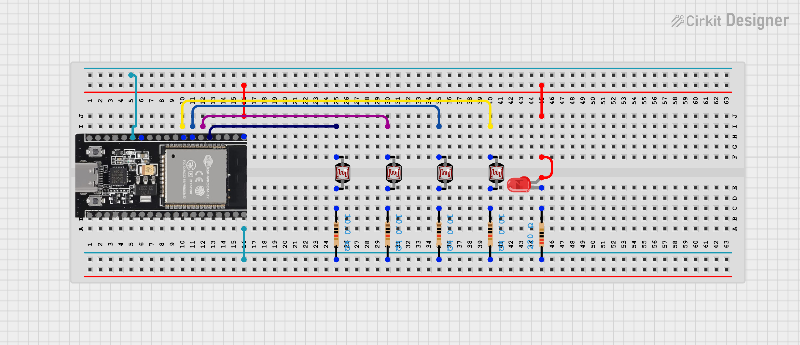
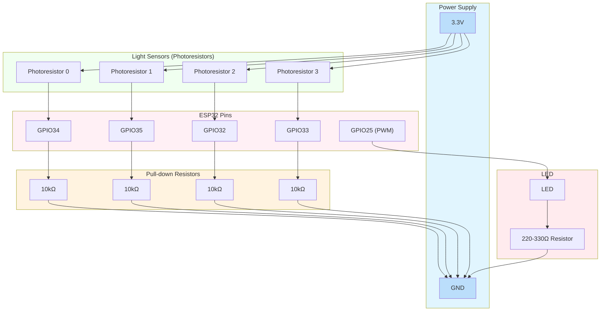
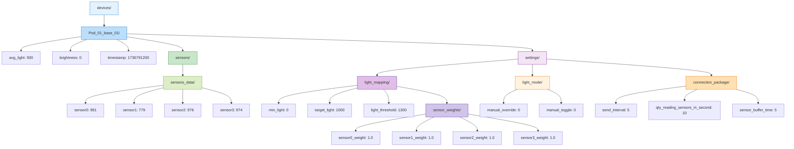

# cicla-ecopod-ESP32-MainUnit


# ESP32 Light Control AI Project Report

This report summarizes the final iteration of the project based on the entire conversation. The project is a simple IoT system for a storage booking pod using ESP32 to monitor light levels from 4 sensors, adjust LED brightness, and store data in Firebase Realtime Database. The "AI" is basic automatic compensation. We focus on the ESP32 code for the main board (Pod_01_base_01), with non-blocking design, sliding window buffer, sensor weights, manual controls, and dynamic settings from Firebase.

The report includes:
- Hardware connection diagram.
- Firebase structure.
- Final code.
- Line-by-line explanation of the code.

## Project Overview

- **Goal**: Monitor light levels, control LED brightness based on sensors, send data to Firebase for a booking system (e.g., light indicates pod status).
- **Hardware**: ESP32 board, 4 photoresistors (light sensors), 1 LED.
- **Features**: Sliding window averaging over time (in seconds), sensor weights (0.0-1.0), threshold, target compensation, manual override/toggle, configurable intervals.
- **Code Style**: Basic C++ for Arduino, non-blocking (millis instead of delay), structured with functions for readability.
- **Firebase**: Realtime Database with unique device ID, dynamic settings.

## Hardware Connection Diagram

The ESP32 uses analog pins for sensors and PWM for LED. Photoresistors are connected as voltage dividers.

```
3.3V ─────┬──────────────────────┬──────────────────────┬──────────────────────┬──────────────────────┐
          │                      │                      │                      │
      Photoresistor           Photoresistor           Photoresistor           Photoresistor
          │                      │                      │                      │
          ├──── GPIO34           ├──── GPIO35           ├──── GPIO32           ├──── GPIO33
          │                      │                      │                      │
       10kΩ resistor          10kΩ resistor          10kΩ resistor          10kΩ resistor
          │                      │                      │                      │
         GND                    GND                    GND                    GND

LED:
GPIO25 ── LED (anod) ── 220-330Ω resistor ── GND (cathode)
```

- Photoresistor: One end to 3.3V, other to GPIO pin and 10kΩ to GND (voltage divider).
- LED: Anod to GPIO25, cathode through resistor to GND for PWM brightness control.


<details>
<summary>Push to, Alternative mermaid diagram</summary>


</details>

## Firebase Structure

The structure is hierarchical, with unique device ID. Settings are configurable remotely.

```
devices/
  Pod_01_base_01/
    avg_light: 930
    brightness: 0
    timestamp: 1736791200
    sensors/
      sensors_data/
        sensor0: 991
        sensor1: 779
        sensor2: 976
        sensor3: 974
    settings/
      light_mapping/
        min_light: 0
        target_light: 1000
        light_threshold: 1300
        sensor_weights/
          sensor0_weight: 1.0
          sensor1_weight: 1.0
          sensor2_weight: 1.0
          sensor3_weight: 1.0
      light_mode/
        manual_override: 0
        manual_toggle: 0
      connection_package/
        send_interval: 5
        qty_reading_sensors_in_second: 10
        sensor_buffer_time: 5
  Pod_01_sensor_02/  // For future boards
    ...
  Pod_01_actuator_01/
    ...
```

<details>
<summary>Push to, Alternative mermaid diagram</summary>

          


</details>
## Final Code

This is the complete code from the last iteration, with functions for readability, non-blocking timing, sliding window buffer, sensor weights, manual controls, and dynamic settings.

```cpp
#include <WiFi.h>
#include <Firebase_ESP_Client.h>

// WiFi
const char* ssid = "MEO-2hzF96460";
const char* password = "FpxA9bv8";

// Firebase
#define FIREBASE_HOST "booking-ee47f-default-rtdb.europe-west1.firebasedatabase.app"
#define FIREBASE_AUTH "m3uCFaiui2EXuQdpZGuuIgwgarKXH5lojbhUgF5b"

// Имя устройства
const String device_id = "Pod_01_base_01";

// Пины
const int sensorPin0 = 34;
const int sensorPin1 = 35;
const int sensorPin2 = 32;
const int sensorPin3 = 33;
const int ledPin = 25;

// Максимальный размер буфера
const int max_buffer_size = 600;

// Структура для чтения + времени
struct Reading {
  int value;
  unsigned long timestamp;
};

Reading buffer0[max_buffer_size];
Reading buffer1[max_buffer_size];
Reading buffer2[max_buffer_size];
Reading buffer3[max_buffer_size];
int buffer_index = 0;

// Настройки (начальные)
int min_light = 0;
int target_light = 1000;
int light_threshold = 1300;
int send_interval = 5;
int qty_reading_sensors_in_second = 10;
int sensor_buffer_time = 5;
int manual_override = 0;
int manual_toggle = 0;

// Веса датчиков 0.0 - 1.0 (начальные = 1.0)
float sensor0_weight = 1.0;
float sensor1_weight = 1.0;
float sensor2_weight = 1.0;
float sensor3_weight = 1.0;

// Таймеры
unsigned long last_sensor_read = 0;
unsigned long last_settings_read = 0;
unsigned long last_send = 0;
int read_delay = 100;

// Яркость
int current_brightness = 0;

// Firebase
FirebaseData fbdo;
FirebaseAuth auth;
FirebaseConfig config;

// Функция: Чтение одного датчика и запись в буфер
void readAndStoreSensor(int pin, Reading buffer[], int index, unsigned long time) {
  buffer[index].value = analogRead(pin);
  buffer[index].timestamp = time;
}

// Функция: Чтение всех датчиков
void readAllSensors() {
  unsigned long now = millis();
  if (now - last_sensor_read >= read_delay) {
    readAndStoreSensor(sensorPin0, buffer0, buffer_index, now);
    readAndStoreSensor(sensorPin1, buffer1, buffer_index, now);
    readAndStoreSensor(sensorPin2, buffer2, buffer_index, now);
    readAndStoreSensor(sensorPin3, buffer3, buffer_index, now);

    buffer_index = buffer_index + 1;
    if (buffer_index >= max_buffer_size) {
      buffer_index = 0;
    }

    last_sensor_read = now;
  }
}

// Функция: Расчёт среднего за последние N секунд
int calculateAverage(Reading buffer[], int window_seconds) {
  unsigned long now = millis();
  unsigned long window_start = now - (window_seconds * 1000);

  long sum = 0;
  int count = 0;
  int i;
  for (i = 0; i < max_buffer_size; i++) {
    if (buffer[i].timestamp >= window_start && buffer[i].timestamp > 0) {
      sum = sum + buffer[i].value;
      count = count + 1;
    }
  }
  if (count == 0) return 0;
  return sum / count;
}

// Функция: Расчёт взвешенного среднего
int calculateWeightedAverage(int a0, int a1, int a2, int a3) {
  float total_weight = sensor0_weight + sensor1_weight + sensor2_weight + sensor3_weight;
  if (total_weight == 0) total_weight = 1;
  return (a0 * sensor0_weight + a1 * sensor1_weight + a2 * sensor2_weight + a3 * sensor3_weight) / total_weight;
}

// Функция: Управление яркостью LED
void controlLED(int weighted_avg) {
  int brightness = 0;
  if (manual_override == 1) {
    if (manual_toggle == 1) {
      brightness = 255;
    } else {
      brightness = 0;
    }
  } else {
    if (weighted_avg < light_threshold) {
      brightness = (light_threshold - weighted_avg) * 255 / (light_threshold - min_light);
      if (brightness < 0) brightness = 0;
      if (brightness > 255) brightness = 255;

      int error = target_light - weighted_avg;
      brightness = brightness + error / 20;
      if (brightness < 0) brightness = 0;
      if (brightness > 255) brightness = 255;
    }
  }
  ledcWrite(ledPin, brightness);
  current_brightness = brightness;
}

// Функция: Чтение настроек из Firebase
void readSettingsFromFirebase() {
  unsigned long now = millis();
  if (now - last_settings_read >= 10000) {
    String light_path = "devices/" + device_id + "/settings/light_mapping/";
    String conn_path = "devices/" + device_id + "/settings/connection_package/";
    String mode_path = "devices/" + device_id + "/settings/light_mode/";
    String weights_path = light_path + "sensor_weights/";

    Firebase.RTDB.getInt(&fbdo, light_path + "min_light", &min_light);
    Firebase.RTDB.getInt(&fbdo, light_path + "target_light", &target_light);
    Firebase.RTDB.getInt(&fbdo, light_path + "light_threshold", &light_threshold);

    Firebase.RTDB.getFloat(&fbdo, weights_path + "sensor0_weight", &sensor0_weight);
    Firebase.RTDB.getFloat(&fbdo, weights_path + "sensor1_weight", &sensor1_weight);
    Firebase.RTDB.getFloat(&fbdo, weights_path + "sensor2_weight", &sensor2_weight);
    Firebase.RTDB.getFloat(&fbdo, weights_path + "sensor3_weight", &sensor3_weight);

    Firebase.RTDB.getInt(&fbdo, conn_path + "send_interval", &send_interval);
    Firebase.RTDB.getInt(&fbdo, conn_path + "qty_reading_sensors_in_second", &qty_reading_sensors_in_second);
    Firebase.RTDB.getInt(&fbdo, conn_path + "sensor_buffer_time", &sensor_buffer_time);

    Firebase.RTDB.getInt(&fbdo, mode_path + "manual_override", &manual_override);
    Firebase.RTDB.getInt(&fbdo, mode_path + "manual_toggle", &manual_toggle);

    read_delay = 1000 / qty_reading_sensors_in_second;
    if (read_delay < 10) read_delay = 10;

    last_settings_read = now;
  }
}

// Функция: Отправка данных в Firebase
void sendDataToFirebase(int weighted_avg, int avg0, int avg1, int avg2, int avg3) {
  unsigned long now = millis();
  if (now - last_send >= (send_interval * 1000)) {
    String base_path = "devices/" + device_id + "/";

    Firebase.RTDB.setInt(&fbdo, base_path + "avg_light", weighted_avg);
    Firebase.RTDB.setInt(&fbdo, base_path + "brightness", current_brightness);
    Firebase.RTDB.setInt(&fbdo, base_path + "timestamp", now / 1000);

    String sensors_data_path = base_path + "sensors/sensors_data/";
    Firebase.RTDB.setInt(&fbdo, sensors_data_path + "sensor0", avg0);
    Firebase.RTDB.setInt(&fbdo, sensors_data_path + "sensor1", avg1);
    Firebase.RTDB.setInt(&fbdo, sensors_data_path + "sensor2", avg2);
    Firebase.RTDB.setInt(&fbdo, sensors_data_path + "sensor3", avg3);

    last_send = now;
  }
}

void setup() {
  Serial.begin(115200);

  WiFi.begin(ssid, password);
  while (WiFi.status() != WL_CONNECTED) {
    delay(500);
    Serial.print(".");
  }
  Serial.println("WiFi connected");

  ledcAttach(ledPin, 5000, 8);

  // Буфер нулями
  int i;
  for (i = 0; i < max_buffer_size; i++) {
    buffer0[i].value = 0;
    buffer0[i].timestamp = 0;
    buffer1[i].value = 0;
    buffer1[i].timestamp = 0;
    buffer2[i].value = 0;
    buffer2[i].timestamp = 0;
    buffer3[i].value = 0;
    buffer3[i].timestamp = 0;
  }

  // Firebase
  config.database_url = FIREBASE_HOST;
  config.signer.tokens.legacy_token = FIREBASE_AUTH;
  Firebase.begin(&config, &auth);
  Firebase.reconnectWiFi(true);

  Serial.println("Ready");
}

void loop() {
  readAllSensors();

  readSettingsFromFirebase();

  // Расчёт средних за окно
  int avg0 = calculateAverage(buffer0, sensor_buffer_time);
  int avg1 = calculateAverage(buffer1, sensor_buffer_time);
  int avg2 = calculateAverage(buffer2, sensor_buffer_time);
  int avg3 = calculateAverage(buffer3, sensor_buffer_time);

  int weighted_avg = calculateWeightedAverage(avg0, avg1, avg2, avg3);

  controlLED(weighted_avg);

  sendDataToFirebase(weighted_avg, avg0, avg1, avg2, avg3);

  delayMicroseconds(1000);  // 1 мс
}
```

### Line-by-Line Explanation

#### Includes (lines 1-2)
- `#include <WiFi.h>`: Library for WiFi connection.
- `#include <Firebase_ESP_Client.h>`: Library for Firebase Realtime Database.

#### Constants and Global Variables (lines 4-54)
- WiFi credentials (ssid, password).
- Firebase HOST and AUTH.
- device_id for unique Firebase path.
- Sensor and LED pins.
- max_buffer_size = 600 for buffer array.
- Struct Reading for value + timestamp.
- Buffer arrays for each sensor.
- buffer_index for circular buffer.
- Initial settings (min_light, target_light, etc.).
- Weights for sensors (float 0.0-1.0).
- Current buffer size.
- Timers for non-blocking (last_sensor_read, etc.).
- read_delay for sensor reading interval.
- current_brightness for LED.
- Firebase objects (fbdo, auth, config).

#### Function readAndStoreSensor (lines 56-60)
- Reads analog value from pin.
- Stores value and timestamp in buffer at index.

#### Function readAllSensors (lines 62-80)
- Checks if time for reading (now - last_sensor_read >= read_delay).
- Calls readAndStoreSensor for each sensor.
- Increments buffer_index, resets if max.
- Updates last_sensor_read.

#### Function calculateAverage (lines 82-100)
- Gets current time.
- Calculates window_start = now - window_seconds * 1000.
- Sums values in buffer where timestamp >= window_start.
- Counts valid entries.
- Returns sum / count (or 0 if no entries).

#### Function calculateWeightedAverage (lines 102-110)
- Calculates total_weight from weights.
- Returns weighted sum / total_weight (protection from 0).

#### Function controlLED (lines 112-133)
- Sets brightness = 0.
- If manual_override = 1:
  - If manual_toggle = 1: brightness = 255.
  - Else: brightness = 0.
- Else (auto mode):
  - If weighted_avg < light_threshold:
    - Calculates mappped brightness.
    - Adds error correction (target - avg) / 20.
    - Clamps 0-255.
- Sets LED with ledcWrite.

#### Function readSettingsFromFirebase (lines 135-171)
- Checks if time for reading settings (now - last_settings_read >= 10000).
- Defines paths for light, conn, mode, weights.
- Gets all settings with getInt or getFloat.
- Updates read_delay.
- Updates last_settings_read.

#### Function sendDataToFirebase (lines 173-198)
- Checks if time for sending (now - last_send >= send_interval * 1000).
- Defines base_path.
- Sets avg_light, brightness, timestamp.
- Sets sensors_data/sensor0 etc.
- Updates last_send.

#### setup() (lines 200-232)
- Starts serial.
- Connects WiFi.
- Sets up LED PWM.
- Fills buffer with 0.
- Starts Firebase.
- Prints "Ready".

#### loop() (lines 234-246)
- Calls readAllSensors().
- Calls readSettingsFromFirebase().
- Calculates avg0-avg3 with calculateAverage.
- Calculates weighted_avg.
- Calls controlLED.
- Calls sendDataToFirebase.
- Minimal pause delayMicroseconds(1000).

### Main Logic Flowchart

```mermaid
flowchart TD
    A["Start: Power On ESP32"] --> B["setup()"]
    B --> B1["Initialize Serial Monitor"]
    B1 --> B2["Connect to WiFi"]
    B2 --> B3["Setup LED PWM on GPIO25"]
    B3 --> B4["Initialize Buffer to Zero"]
    B4 --> B5["Initialize Firebase Connection"]
    B5 --> C["Enter loop() - Main Cycle"]

    C --> D{"Time to read sensors?"}
    D -->|"Yes"| E["Read 4 analog sensors"]
    E --> F["Store value + current timestamp in circular buffer"]
    F --> G["Update Buffer Index"]
    G --> H{"Time to read settings from Firebase? (every 10s)"}

    H -->|"Yes"| I["Read all settings from Firebase"]
    I --> I1["Update min_light, target_light, light_threshold"]
    I1 --> I2["Update sensor weights (0.0-1.0)"]
    I2 --> I3["Update manual_override & manual_toggle"]
    I3 --> I4["Update send_interval, qty_reading_sensors_in_second, sensor_buffer_time"]
    I4 --> I5["Recalculate read_delay"]
    I5 --> J["Calculate averages from sliding window"]

    J --> J1["For each sensor: sum values where timestamp >= now - sensor_buffer_time seconds"]
    J1 --> J2["Compute avg0, avg1, avg2, avg3"]
    J2 --> K["Calculate weighted_avg using sensor weights"]
    K --> L["Control LED"]

    L --> L1{"manual_override == 1?"}
    L1 -->|"Yes"| L2{"manual_toggle == 1?"}
    L2 -->|"Yes"| L3["brightness = 255 (full on)"]
    L2 -->|"No"| L4["brightness = 0 (off)"]
    L1 -->|"No (Auto mode)"| L5{"weighted_avg < light_threshold?"}
    L5 -->|"No"| L4
    L5 -->|"Yes"| L6["Map brightness in working range"]
    L6 --> L7["Add compensation: error = target_light - weighted_avg; brightness += error/20"]
    L7 --> L8["Clamp brightness to 0-255"]
    L8 --> L9["Set LED Brightness with ledcWrite"]

    L9 --> M{"Time to send data to Firebase?"}
    M -->|"Yes"| N["Send to Firebase"]
    N --> N1["Set avg_light = weighted_avg"]
    N1 --> N2["Set brightness = current_brightness"]
    N2 --> N3["Set timestamp"]
    N3 --> N4["Set sensors/sensors_data/sensor0 to sensor3 = avg0-avg3"]
    N4 --> C

    M -->|"No"| C
    H -->|"No"| J
    D -->|"No"| H

    style A fill:#f9f,stroke:#333
    style C fill:#bbf,stroke:#333
    style L fill:#ff9,stroke:#333
```

